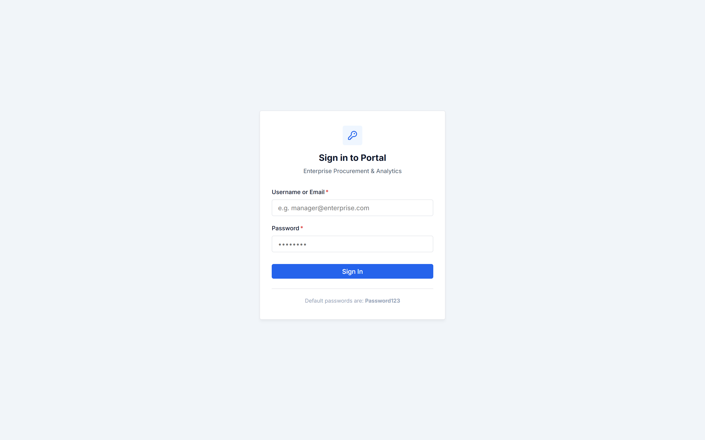
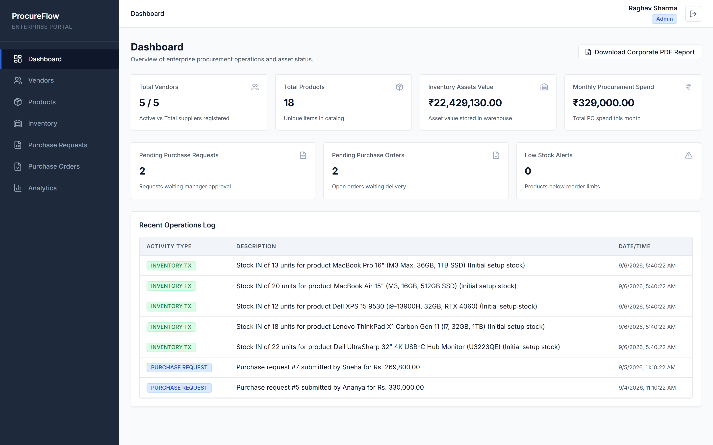
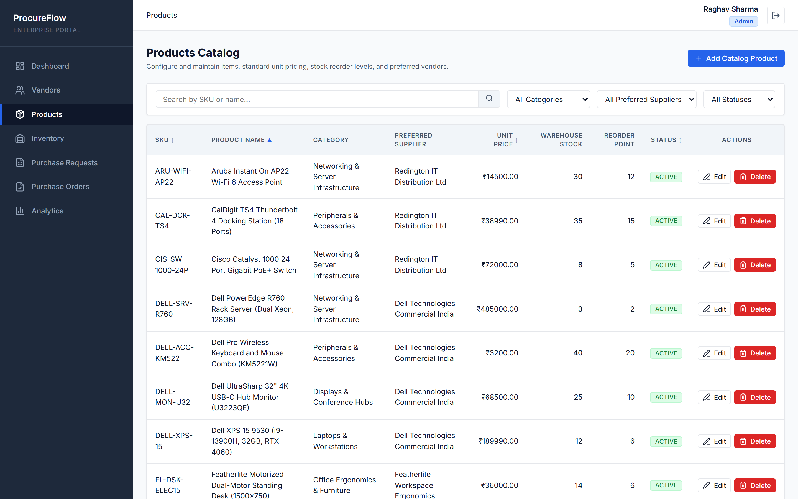
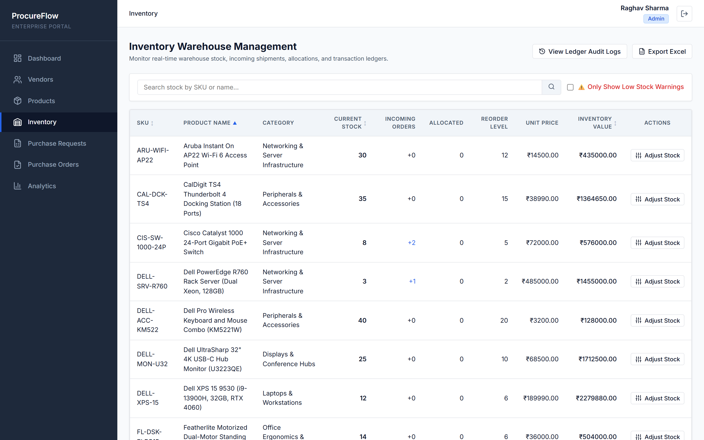
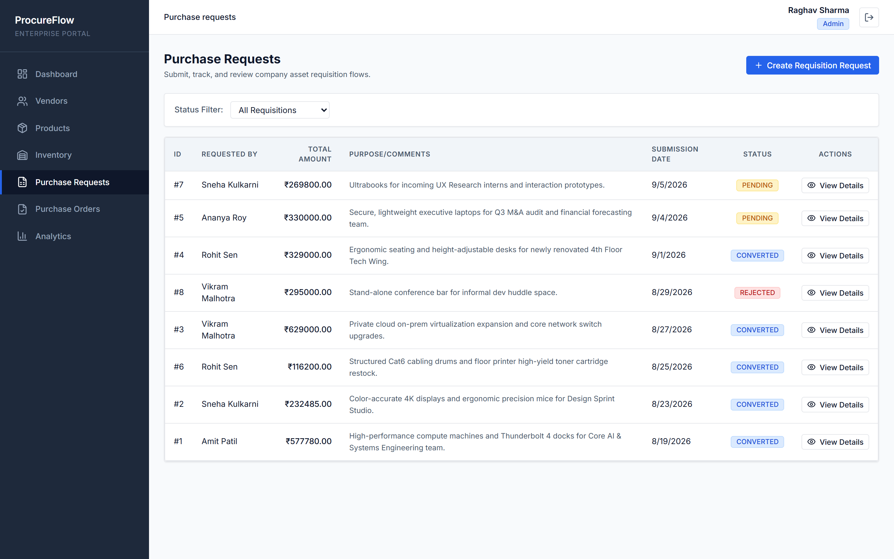
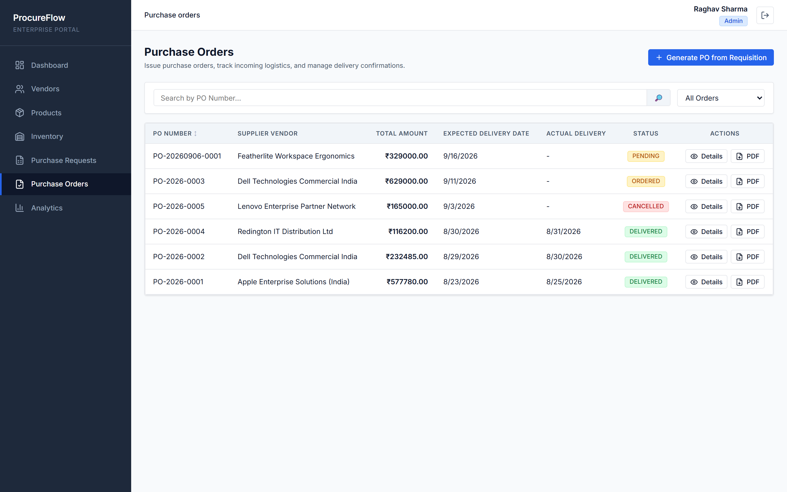
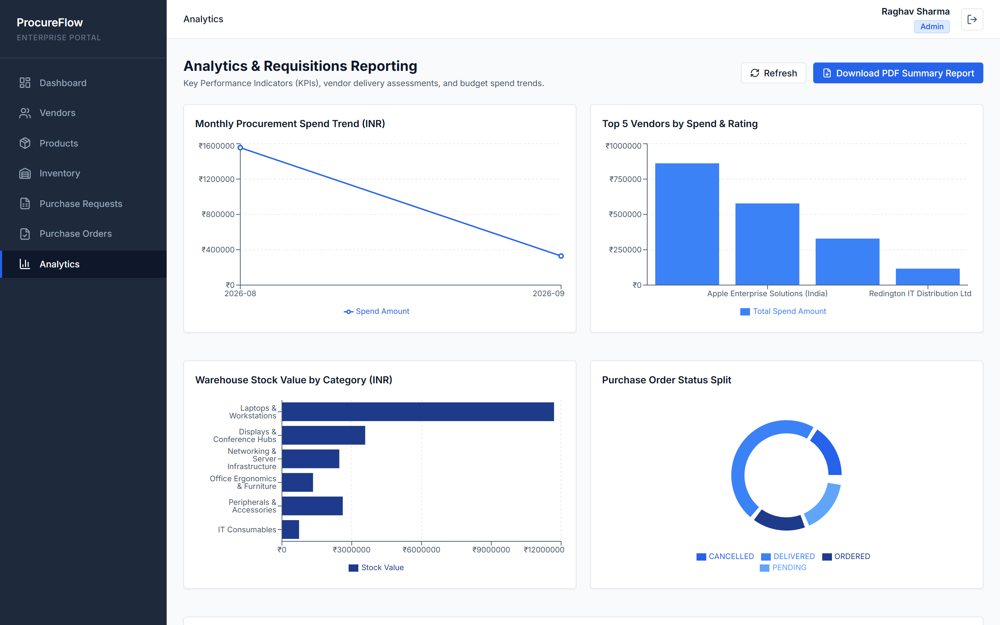
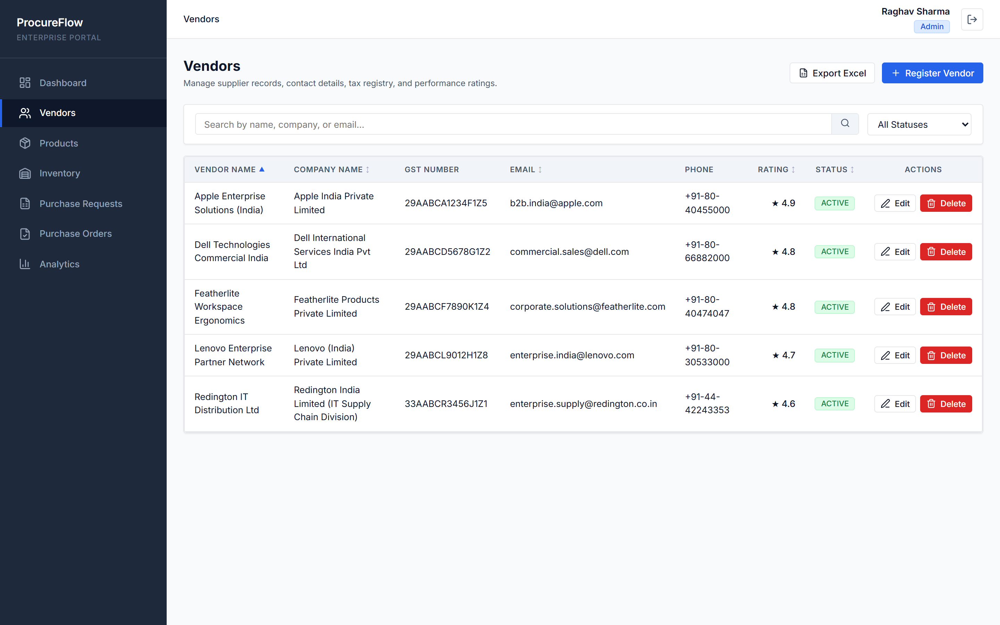
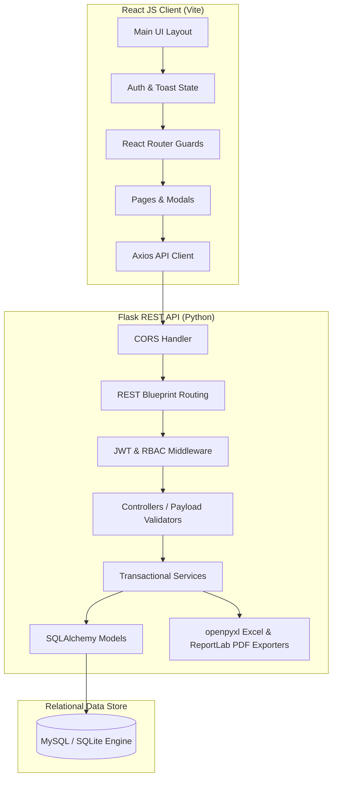

# ProcureFlow: Multi-Vendor Enterprise IT & Corporate Facilities Procurement Platform

ProcureFlow is a production-grade, full-stack enterprise internal application designed to streamline corporate procurement workflows, inventory management, purchase requisition lifecycle controls, and vendor performance analytics across multi-vendor IT hardware and corporate facility assets.

This project demonstrates clean architecture, 3NF database designs, secure JWT authentication with Role-Based Access Control (RBAC), and interactive data visualization.

---

## 📚 In-Depth Project Documentation

For complete architectural and operational breakdowns, explore the detailed study guides:
- 📖 **[The Layman's Guide to Enterprise Procurement](detailed_study/layman_explanation.md)**: Easy-to-understand explanation of PR vs PO, character personas, 6-step purchasing lifecycle, and business rules.
- 🗄️ **[Relational Database Schema & SQL Mechanics](detailed_study/database_explanation.md)**: 3NF ER diagram, table-by-table data dictionary, foreign key constraints, indexes, and double-entry inventory triggers.
- ⚙️ **[System Architecture & Working Model](detailed_study/project_working.md)**: End-to-end data flow, REST API endpoints, JWT authentication tokens, PDF invoice generator, and state management.

---

## 🎨 System Highlights & Screenshots

### 1. Secure Portal Authentication
Security-first JWT sign-in screen supporting session recovery, password verification, and automatic token refresh mechanisms.



### 2. Operational Analytics Dashboard
Interactive, responsive 2D Recharts dashboard mapping monthly procurement spend trends, active vendor ratings, stock values by category, and purchase order splits.



### 3. Multi-Vendor Products Catalog
Enterprise inventory catalog with 18 products in Indian Rupees (₹), warehouse reorder limits, and preferred supplier vendors (Apple, Dell, Lenovo, Redington, Featherlite).



### 4. Warehouse Inventory Levels & Ledger
Real-time stock monitoring with low-stock warning indicators, manual adjustment modals, and a comprehensive transaction history audit log.



### 5. Purchase Requisitions (PR) & Manager Reviews
Dynamic line-item selectors for department leads to submit bulk requisitions and a manager review terminal to approve or reject items with custom feedback.



### 6. Purchase Orders (PO) & Logistics
Purchase requests conversion, shipping logistics updates, and in-memory generated invoice PDF downloads.



### 7. Interactive Analytics Visualizations
Visualized procurement KPIs including monthly spending trends, top 5 vendor performance metrics, and warehouse stock values.



### 8. Preferred Supplier Directory
Full database of authorized supplier partners complete with business registry numbers, GST verification, contact parameters, ratings, and status monitors.



---

## 🏗️ Architecture & Data Flows

The platform is designed following the **Separation of Concerns (SoC)** principle, separating the React client frontend from the Flask REST API backend:



---

## 💻 Technology Stack

### Backend
- **Python 3.11+ / Flask**: RESTful route handlers and Blueprint organization.
- **SQLAlchemy (ORM)**: Database-agnostic schema mapping (MySQL & SQLite).
- **PyMySQL & PyJWT**: Database connections and JWT session claim parsing.
- **Bcrypt**: Industry-standard cryptographic password hashing (`gensalt()`).
- **OpenPyXL & ReportLab**: In-memory Excel spreadsheets and PDF document generation.

### Frontend
- **ReactJS**: Component-driven Single Page Application.
- **Vite**: Ultra-fast bundler and hot module replacement.
- **Recharts**: Flat 2D visualization charts.
- **Lucide React**: Clean vector icons.
- **Vanilla CSS**: Clean, information-dense CSS (Atlassian/Jira design system).

---

## 🏢 Multi-Vendor Enterprise Ecosystem

### 5 Authorized Suppliers
1. **Apple Enterprise Solutions (India)** (Laptops & Developer Gear)
2. **Dell Technologies Commercial India** (Workstations, 4K Displays & Rack Servers)
3. **Lenovo Enterprise Partner Network** (Executive ThinkPads & Monitors)
4. **Redington IT Distribution Ltd** (Networking, Peripherals & Consumables)
5. **Featherlite Workspace Ergonomics** (Ergonomic Seating & Standing Desks)

### 6 Product Categories (18 Products in INR)
- **Laptops & Workstations**: MacBook Pro 16" M3 Max, MacBook Air 15", Dell XPS 15, Lenovo ThinkPad X1 Carbon
- **Displays & Conference Hubs**: Dell UltraSharp 32" 4K USB-C Hub Monitor, Logitech 4K Rally Bar, Lenovo ThinkVision 27" QHD
- **Networking & Server Infrastructure**: Dell PowerEdge R760 Rack Server, Cisco Catalyst 1000 24P PoE+ Switch, Aruba AP22 Wi-Fi 6
- **Office Ergonomics & Furniture**: Featherlite Optima Mesh Ergonomic Chair, Featherlite Motorized Standing Desk
- **Peripherals & Accessories**: CalDigit TS4 Thunderbolt 4 Dock, Logitech MX Master 3S Mouse, Jabra Evolve2 75 Headset, Dell Wireless Combo
- **IT Consumables**: Schneider Electric Cat6 305m Cable Drum, HP LaserJet High Yield Toner Pack

---

## 🛠️ Installation & Local Setup

### Prerequisites
- **Python 3.11+**
- **Node.js 18+**
- **npm** or **yarn**

---

### Step 1: Initialize the Database (SQLite Fallback)
The platform defaults to a local file-based SQLite database (`procurement.db`) for immediate local run without requiring database server configurations.

1. Navigate to the project root directory:
   ```bash
   cd d:/Projects/procurement_flask
   ```
2. Set up the Python virtual environment:
   ```bash
   python -m venv backend/.venv
   ```
3. Activate the virtual environment:
   - **PowerShell**:
     ```powershell
     .\backend\.venv\Scripts\Activate.ps1
     ```
   - **Command Prompt / Git Bash**:
     ```bash
     source backend/.venv/Scripts/activate
     ```
4. Install python dependencies:
   ```bash
   python -m pip install -r backend/requirements.txt
   ```
5. Run the database initialization and seed script:
   ```bash
   python -m backend.init_db
   ```
   *This creates the SQLite database file inside `backend/instance/procurement.db` and populates 18 enterprise products across 6 categories, 5 suppliers, 8 departmental users, and cross-departmental requisition history.*

---

### Step 2: Start the REST API Backend
Launch the Flask development server (runs on port `5001`):
```bash
python -m backend.run
```
The console will print:
`* Running on http://127.0.0.1:5001`

---

### Step 3: Start the React Frontend
Open a new terminal session, navigate to the `frontend/` directory, install dependencies, and boot Vite (runs on port `5175`):
```bash
cd frontend
npm install
npm run dev
```

The server will ready:
`➜  Local:   http://localhost:5175/`

---

## 🔑 Demo Login Credentials

All pre-seeded test accounts use the common enterprise password: **`Password123`**

| # | Role Access | Username | Full Name | Department / Persona | What to Test |
| :-: | :--- | :--- | :--- | :--- | :--- |
| **1** | **Admin** | `admin` | **Raghav Sharma** | Corporate IT & Platform Admin | Full analytics, vendors CRUD, product catalog management, system-wide transaction history. |
| **2** | **Procurement Officer** | `officer` | **Rajesh Verma** | SCM & Purchasing | Convert approved PRs to POs, manage warehouse stock, receive delivery shipments, download PO invoices. |
| **3** | **Manager** | `manager` | **Priyanka Joshi** | Management & Budgets | Spend analytics charts, approve/reject pending purchase requests with feedback comments. |
| **4** | **Employee** | `employee` | **Amit Patil** | Core Engineering Lead | Create high-end developer hardware PRs (MacBook Pro 16", Thunderbolt 4 docks). |
| **5** | **Employee** | `sneha` | **Sneha Kulkarni** | UI/UX Design Lead | Create design studio equipment PRs (4K monitors, MX Master mice, MacBook Airs). |
| **6** | **Employee** | `vikram` | **Vikram Malhotra** | Cloud & Infra Lead | Create server & networking PRs (Rack servers, Cisco PoE+ switches, access points). |
| **7** | **Employee** | `ananya` | **Ananya Roy** | Finance Analyst | Create executive ultrabook PRs (Lenovo ThinkPad X1 Carbon Gen 11). |
| **8** | **Employee** | `rohit` | **Rohit Sen** | Facilities Lead | Create office ergonomics & cabling PRs (Featherlite chairs, standing desks, Cat6 cabling). |

---

## 🧪 Running Unit Tests
Execute the backend routing validations (uses SQLite in-memory database to run instantly):
```bash
python -m unittest discover -s backend/tests -p "test_*.py"
```
Output:
`Ran 3 tests - OK`
